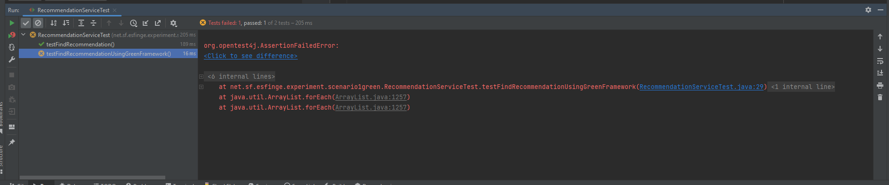

# 🛒 Product Recommendation System – Greensfinge Experiment

The project follows a simple architecture with a service and a test class for validating the recommendation logic. It is part of an experiment to demonstrate how energy-saving strategies can be integrated into Java applications using the **Greensfinge Framework**.

## 📦 Project Structure

The project follows a simple architecture with a service, entity and repository.

## ✅ Description

- `entity.Recommendation`: Contains the business entity class.
- `service.RecommendationService`: Contains the business logic to format a recommendation.
- `repository.RecommendationRepository`: Simulates a database to search the values.

The RecommendationRepository class can be "greenified" using `GreenFactory`, allowing its behavior to change based on energy-efficiency configurations.

### ❓ Task

In the RecomendationService class, the method findRecomendation() search for the product and the number of visits. Currently this method also returns another product suggestion. To save energy when the user don't want to see his additional suggestion, you need to implement the functionality to make this second suggestion optional.

To implement this functionality, when the new method saveConsumptionEnergy() is called with the parameter "true", the second suggestion should be disabled. The method saveConsumptionEnergy() is empty and you need to implement it as part of your task using the green framework.

---

## 🧪 Unit Tests

The test class `RecommendationServiceTest` validates the behavior of the recommendation logic:

When you open the project, to make sure that everything is correctly configured, you need to run the tests and the result should be the one in the picture: one test will pass and the other not. When you make all tests pass successfully, your task is complete.

IMPORTANT: You cannot change the test code!.

